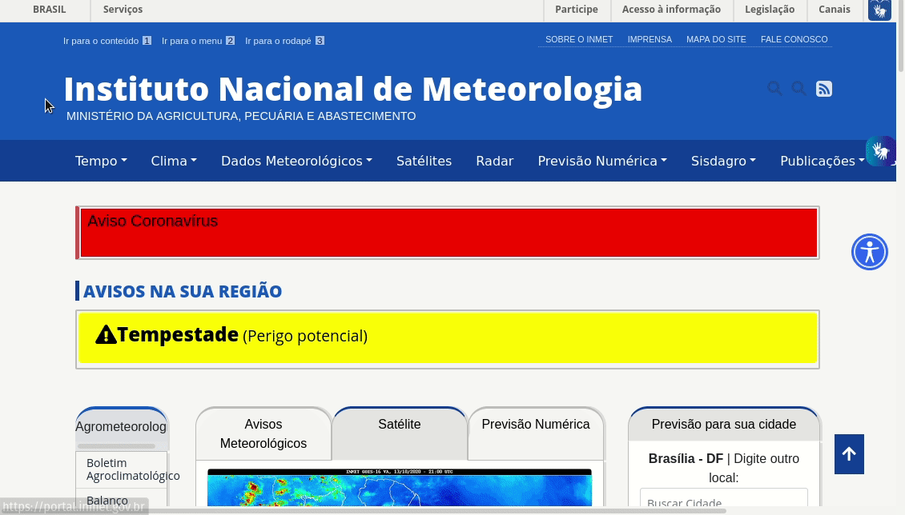
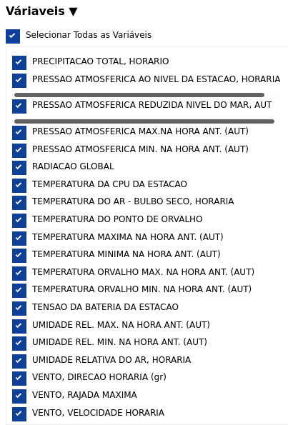
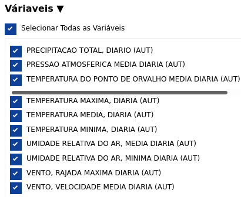

# Notebooks Dados Metereológicos

[toc]

## Resumo

​	Nos códigos referentes aos Dados Metereológicos tivemos como objetivo visualizar os dados de temperatura, chuva, radiação solar e velocidade do vento, apresentando o máximo diário e semanal por ano, de 2008 até 2013.  ( Algumas outras informações além dos máximos, também foram apresentadas graficamente para averiguarmos a utilidade delas. Se for desejado, retiro.)  

## Site INMET

​	O primeiro passo para alcançar o objetivo foi o de explorar o [site do Instituto Nacional  de Meteorologia (INMET)](https://portal.inmet.gov.br/ "site do INMET") para ver a melhor forma de se obter os dados meteorológicos de João Pessoa no intervalo de tempo do dia 01 de janeiro de 2008 até 31 de dezembro de 2013.

### Caminho escolhido para acessar os dados

​	Ainda em reunião foi comentado como eram coletados os dados anteriormente, então decidi reproduzir o caminho que gerasse esse resultado. Primeiro, acessei na aba dados metereológicos a opção "Banco de Dados Meteorológicos", fui até prosseguir no final da página ao acessar é pedido o email e então prosseguir. O procedimento pode ser visto pelo gif abaixo.

Após isso é aberto uma página que torna possível a escolha por:

- Tipo de dados:
  - Dados Horários
  - Dados Diários
  - Dados Mensais
- Tipo de estação:
  - Automáticas
  - Convencionais
- Abrangência:
  - País
  - Região

### Detalhes da escolha

​	Foram escolhidos os dados horários para se obter as informações diárias das variáveis e os dados diários para se obter os dados semanais. Ambos os arquivos csv dos dados encontram-se na pasta [Dados/Dados-Meteorologicos](https://github.com/V-kr0pt/previsao-de-demanda/tree/main/Dados/Dados-Metereologicos). 

​	O tipo de estação escolhido foi "Automáticas", a abrangência: região, escolhido nordeste e por fim a estação A320 em João Pessoa. As variáveis disponíveis entre o banco de dados diário e horário são diferentes entre si, como pode se ver nas imagens seguintes:

- Variáveis dos Dados Horários	

######   

- Variáveis dos Dados Diários 

###### 