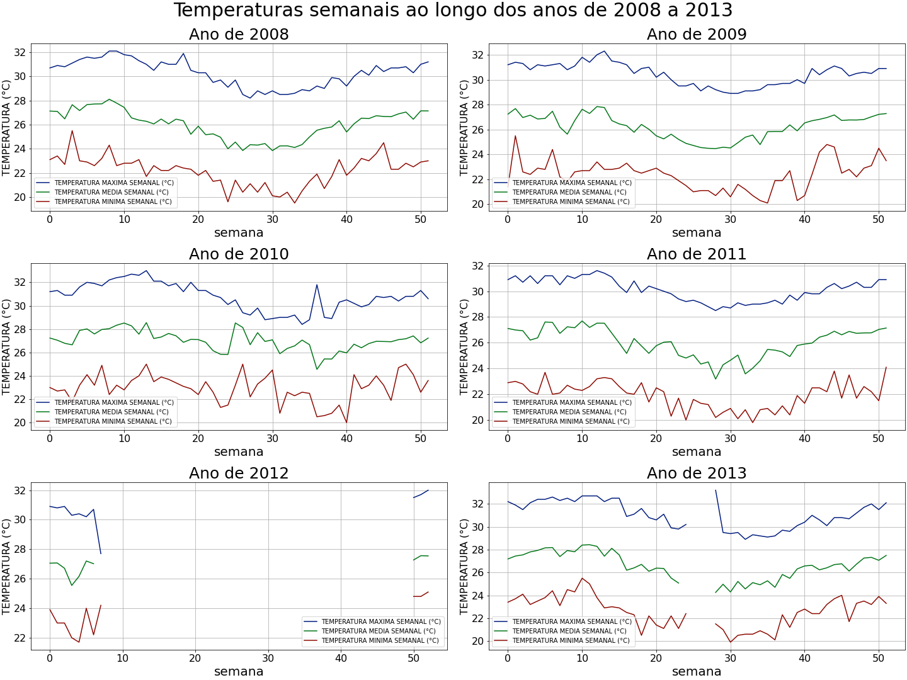
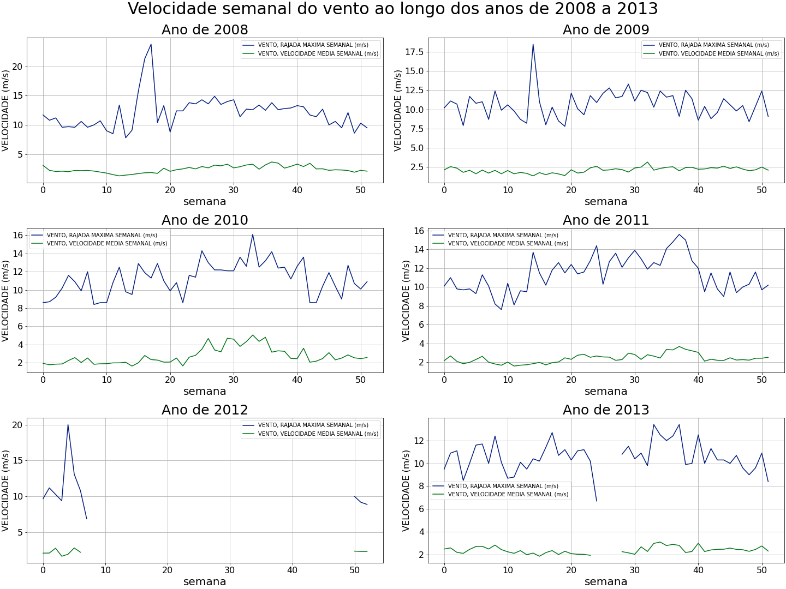
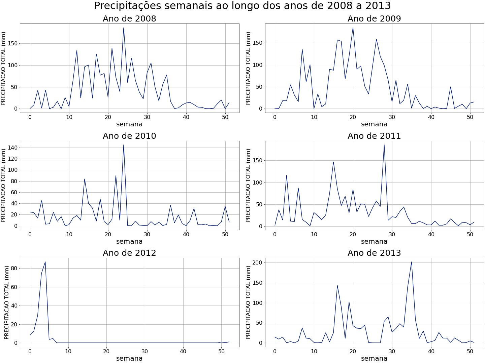

# Notebooks Dados Metereológicos

[toc]

## Resumo

​	Nos códigos referentes aos Dados Metereológicos tivemos como objetivo visualizar os dados de temperatura, chuva, radiação solar e velocidade do vento, apresentando o máximo diário e semanal por ano, de 2008 até 2013.  ( Algumas outras informações além dos máximos, também foram apresentadas graficamente para averiguarmos a utilidade delas. Se for desejado, retiro.)  

## Coleta de Dados (INMET)

​	O primeiro passo para alcançar o objetivo foi o de explorar o [site do Instituto Nacional  de Meteorologia (INMET)](https://portal.inmet.gov.br/ "site do INMET") para ver a melhor forma de se obter os dados meteorológicos de João Pessoa no intervalo de tempo do dia 01 de janeiro de 2008 até 31 de dezembro de 2013.

### Caminho escolhido para acessar os dados

​	Ainda em reunião foi comentado como eram coletados os dados anteriormente, então decidi reproduzir o caminho que gerasse esse resultado. Primeiro, acessei na aba dados metereológicos a opção "Banco de Dados Meteorológicos", fui até prosseguir no final da página. Ao acessar é pedido o email e então obtemos acesso à página de seleção dos dados desejados. O procedimento pode ser visto pelo gif abaixo.

Após isso é aberto uma página que torna possível a escolha por:

- Tipo de dados:
  - Dados Horários
  - Dados Diários
  - Dados Mensais
- Tipo de estação:
  - Automáticas
  - Convencionais
- Abrangência:
  - País
  - Região

### Detalhes da escolha

​	Foram escolhidos os dados horários e a partir deles foram obtidas as informações diárias das variáveis e, junto a isso, os dados diários para se obter as informações referentes as semanas. Ambos os arquivos csv dos dados encontram-se na pasta [Dados/Dados-Meteorologicos](https://github.com/V-kr0pt/previsao-de-demanda/tree/main/Dados/Dados-Metereologicos). 

​	O tipo de estação escolhida foi a opção "Automáticas", a abrangência: "região" e então "nordeste", por fim a estação "A320" que se localiza na cidade de João Pessoa. 

​	Um fato importante destacar é que as variáveis disponíveis entre o banco de dados diário e horário são diferentes entre si, como pode se ver nas imagens seguintes:

- Variáveis dos Dados Horários	

​	Pode-se ver uma ampla quantidade de variáveis coletadas nos Dados Horários, inclusive a Radiação Global (Radiação Solar) 

- Variáveis dos Dados Diários 

​	Quanto as variáveis dos Dados Diários, conseguimos perceber que algumas das variáveis que estão presentes nos Dados Horários não estão presentes nessa opção. 

​	Em ambos foi marcado a opção de selecionar todas as variáveis para download, assim os dados brutos salvos contém a maior gama possível de variáveis e poderão ser utilizados se desejado. 

## Resultados

​	Após a coleta dos Dados foram criados gráficos utilizando o Jupyter Notebook. Os códigos foram separados em dois, sendo um para obter os gráficos referentes às informações diárias e outro para obter os gráficos com as informações semanais. Ambos os códigos podem ser acessado no início dessa página.

### Apresentação dos Gráficos

​	Os gráficos foram divididos para que em cada [Figure](https://matplotlib.org/3.3.2/tutorials/introductory/usage.html#figure) se encontrasse os plots referentes a variável desejada (Temperatura, Vento, Chuva, Radiação Solar) divididos em [subplots](https://matplotlib.org/3.3.2/tutorials/introductory/usage.html#the-object-oriented-interface-and-the-pyplot-interface) que representam os anos.

#### Gráficos Diários

##### Temperatura

​	

​	Podemos notar alguns dados faltantes em 2010 e fica explícito que em quase todo o ano de 2012 ocorreu algum problema na mensuração.  Ainda, em 2013 conseguimos reparar alguns dados faltantes próximo ao mês 07, mais precisamente do dia 19/06 até o dia 15/07 (tabela ao fim). 

​	Verificaremos ao longo dos outros  gráficos que esse é um comportamento que se repete, ou seja, não é um problema unicamente na mensuração dessa variável, mas sim um problem na estação A320.

##### Vento

​	Podemos verificar que os dados faltantes da velocidade do vento estão em intervalos iguais ou muito próximos dos dados faltantes da variável temperatura.

 ##### Chuvas

​	Os anos de 2010, 2012 e 2013 dos gráficos de chuvas, explicitam que nos intervalos em que as outras variáveis apresentam dados faltantes, os dados de chuvas registram precipitação de 0mm. O que amplia a dificuldade de análise, visto que podem existir dias em que a  precipitação foi realmente de 0mm e outros em que foram dados ocasionados por falhas na medição.

##### Radiação Solar

​	Podemos verificar que além dos dados faltantes nos intervalos  mencionados em outras variáveis a radiação apresenta um comportamento atípico na radiação média do ano de 2010 entre o mês 06 e mês 10.

#### Tabelas Diárias

​	A partir dos gráficos foi analisado os intervalos de dados faltantes e utilizando o Jupyter Notebook criado as tabelas para verificarmos os dados, em que **True** representa dado de pluviosidade igual a 0mm para precipitação total e para as outras variáveis dados faltante, **False** representa o contrário, ou seja, dados existentes e precipitação diferente de 0mm. 

##### Ano de 2010

​	Foi criado uma tabela para verificar que há dados faltantes no ano de 2010, porém de uma forma espaçada.

| DATA DE MEDIÇÃO | TEMPERATURA MÉDIA DO AR DIARIA(°C) | TEMPERATURA MINIMA DIARIA (°C) | TEMPERATURA MAXIMA DIARIA (°C) | PRECIPITACAO TOTAL, DIARIA(mm) | VELOCIDADE MÉDIA DIÁRIA DO VENTO (m/s) | RAJADA MAXIMA DIARIA DO VENTO (m/s) | RADIACAO SOLAR MÉDIA DIÁRIA (Kj/m²) | RADIACAO SOLAR MÁXIMA DIÁRIA (Kj/m²) |
| :-------------- | ---------------------------------- | ------------------------------ | ------------------------------ | ------------------------------ | -------------------------------------- | ----------------------------------- | ----------------------------------- | ------------------------------------ |
| 2010-06-30      | False                              | False                          | False                          | True                           | False                                  | True                                | False                               | False                                |
| 2010-07-01      | True                               | True                           | True                           | True                           | True                                   | True                                | True                                | True                                 |
| 2010-07-02      | False                              | False                          | False                          | True                           | False                                  | False                               | False                               | False                                |
| 2010-07-03      | False                              | False                          | False                          | True                           | False                                  | False                               | False                               | False                                |
| 2010-07-04      | False                              | False                          | False                          | True                           | False                                  | False                               | False                               | False                                |
| 2010-07-05      | False                              | False                          | False                          | True                           | False                                  | False                               | False                               | False                                |
| 2010-07-06      | False                              | False                          | False                          | False                          | False                                  | False                               | False                               | False                                |
| 2010-07-07      | False                              | False                          | False                          | False                          | False                                  | False                               | False                               | False                                |
| 2010-07-08      | False                              | False                          | False                          | True                           | False                                  | False                               | False                               | False                                |
| 2010-07-09      | True                               | True                           | True                           | True                           | True                                   | True                                | True                                | True                                 |
| 2010-07-10      | False                              | False                          | False                          | True                           | False                                  | False                               | False                               | False                                |
| 2010-07-11      | False                              | False                          | False                          | True                           | False                                  | False                               | False                               | False                                |
| 2010-07-12      | False                              | False                          | False                          | False                          | False                                  | False                               | False                               | False                                |
| 2010-07-13      | False                              | False                          | False                          | False                          | False                                  | False                               | False                               | False                                |
| 2010-07-14      | False                              | False                          | False                          | True                           | False                                  | False                               | False                               | False                                |
| 2010-07-15      | False                              | False                          | False                          | True                           | False                                  | False                               | False                               | False                                |
| 2010-07-16      | True                               | True                           | True                           | True                           | True                                   | True                                | True                                | True                                 |
| 2010-07-17      | True                               | True                           | True                           | True                           | True                                   | True                                | True                                | True                                 |
| 2010-07-18      | False                              | False                          | False                          | True                           | False                                  | False                               | False                               | False                                |
| 2010-07-19      | False                              | False                          | False                          | True                           | False                                  | False                               | False                               | False                                |
| 2010-07-20      | False                              | False                          | False                          | True                           | False                                  | False                               | False                               | False                                |
| 2010-07-21      | False                              | False                          | False                          | False                          | False                                  | False                               | False                               | False                                |
| 2010-07-22      | True                               | True                           | True                           | True                           | True                                   | True                                | True                                | True                                 |
| 2010-07-23      | False                              | False                          | False                          | False                          | False                                  | False                               | False                               | False                                |
| 2010-07-24      | False                              | False                          | False                          | True                           | False                                  | False                               | False                               | False                                |
| 2010-07-25      | False                              | False                          | False                          | True                           | False                                  | False                               | False                               | False                                |
| 2010-07-26      | False                              | False                          | False                          | True                           | False                                  | False                               | False                               | False                                |
| 2010-07-27      | False                              | False                          | False                          | True                           | False                                  | False                               | False                               | False                                |
| 2010-07-28      | False                              | False                          | False                          | False                          | False                                  | False                               | False                               | False                                |
| 2010-07-29      | False                              | False                          | False                          | True                           | False                                  | False                               | False                               | False                                |
| 2010-07-30      | False                              | False                          | False                          | True                           | False                                  | False                               | False                               | False                                |
| 2010-07-31      | False                              | False                          | False                          | True                           | False                                  | False                               | False                               | False                                |
| 2010-08-01      | False                              | False                          | False                          | True                           | False                                  | False                               | False                               | False                                |
| 2010-08-02      | False                              | False                          | False                          | False                          | False                                  | False                               | False                               | False                                |
| 2010-08-03      | False                              | False                          | False                          | True                           | False                                  | False                               | False                               | False                                |
| 2010-08-04      | False                              | False                          | False                          | True                           | False                                  | False                               | False                               | False                                |
| 2010-08-05      | False                              | False                          | False                          | False                          | False                                  | False                               | False                               | False                                |
| 2010-08-06      | False                              | False                          | False                          | False                          | False                                  | False                               | False                               | False                                |
| 2010-08-07      | False                              | False                          | False                          | False                          | False                                  | False                               | False                               | False                                |
| 2010-08-08      | False                              | False                          | False                          | True                           | False                                  | False                               | False                               | False                                |
| 2010-08-09      | False                              | False                          | False                          | False                          | False                                  | False                               | False                               | False                                |
| 2010-08-10      | False                              | False                          | False                          | False                          | False                                  | False                               | False                               | False                                |
| 2010-08-11      | False                              | False                          | False                          | True                           | False                                  | False                               | False                               | False                                |
| 2010-08-12      | False                              | False                          | False                          | False                          | False                                  | False                               | False                               | False                                |
| 2010-08-13      | False                              | False                          | False                          | True                           | False                                  | False                               | False                               | False                                |
| 2010-08-14      | False                              | False                          | False                          | True                           | False                                  | False                               | False                               | False                                |
| 2010-08-15      | False                              | False                          | False                          | True                           | False                                  | False                               | False                               | False                                |
| 2010-08-16      | False                              | False                          | False                          | True                           | False                                  | False                               | False                               | False                                |
| 2010-08-17      | False                              | False                          | False                          | False                          | False                                  | False                               | False                               | False                                |
| 2010-08-18      | False                              | False                          | False                          | False                          | False                                  | False                               | False                               | False                                |

##### Ano de 2012

​	Foram criadas duas tabela para análise do ano de 2012 que tornassem possível observar o dia inicial e final em que  os dados são inconsistentes (R: 14/02/2012 até o dia 10/12/2012 os dados são inconsistentes).

​	Analisando o início dos dados faltantes, é possível verificar que a partir do 14/02/2012 os dados são inconsistentes:

| DATA DE MEDIÇÃO | TEMPERATURA MÉDIA DO AR DIARIA(°C) | TEMPERATURA MINIMA DIARIA (°C) | TEMPERATURA MAXIMA DIARIA (°C) | PRECIPITACAO TOTAL, DIARIA(mm) | VELOCIDADE MÉDIA DIÁRIA DO VENTO (m/s) | RAJADA MAXIMA DIARIA DO VENTO (m/s) | RADIACAO SOLAR MÉDIA DIÁRIA (Kj/m²) | RADIACAO SOLAR MÁXIMA DIÁRIA (Kj/m²) |
| --------------- | ---------------------------------- | ------------------------------ | ------------------------------ | ------------------------------ | -------------------------------------- | ----------------------------------- | ----------------------------------- | ------------------------------------ |
| 2012-02-05      | False                              | False                          | False                          | True                           | False                                  | False                               | False                               | False                                |
| 2012-02-06      | False                              | False                          | False                          | False                          | False                                  | False                               | False                               | False                                |
| 2012-02-07      | False                              | False                          | False                          | False                          | False                                  | False                               | False                               | False                                |
| 2012-02-08      | False                              | False                          | False                          | True                           | False                                  | False                               | False                               | False                                |
| 2012-02-09      | False                              | False                          | False                          | True                           | False                                  | False                               | False                               | False                                |
| 2012-02-10      | False                              | False                          | False                          | False                          | False                                  | False                               | False                               | False                                |
| 2012-02-11      | False                              | False                          | False                          | True                           | False                                  | False                               | False                               | False                                |
| 2012-02-12      | False                              | False                          | False                          | True                           | False                                  | False                               | False                               | False                                |
| 2012-02-13      | False                              | False                          | False                          | True                           | False                                  | False                               | False                               | False                                |
| 2012-02-14      | True                               | True                           | True                           | True                           | True                                   | True                                | True                                | True                                 |
| 2012-02-15      | True                               | True                           | True                           | True                           | True                                   | True                                | True                                | True                                 |
| 2012-02-16      | True                               | True                           | True                           | True                           | True                                   | True                                | True                                | True                                 |
| 2012-02-17      | True                               | True                           | True                           | True                           | True                                   | True                                | True                                | True                                 |
| 2012-02-18      | True                               | True                           | True                           | True                           | True                                   | True                                | True                                | True                                 |
| 2012-02-19      | True                               | True                           | True                           | True                           | True                                   | True                                | True                                | True                                 |
| 2012-02-20      | True                               | True                           | True                           | True                           | True                                   | True                                | True                                | True                                 |
| 2012-02-21      | True                               | True                           | True                           | True                           | True                                   | True                                | True                                | True                                 |
| 2012-02-22      | True                               | True                           | True                           | True                           | True                                   | True                                | True                                | True                                 |
| 2012-02-23      | True                               | True                           | True                           | True                           | True                                   | True                                | True                                | True                                 |
| 2012-02-24      | True                               | True                           | True                           | True                           | True                                   | True                                | True                                | True                                 |

​	Realizando um corte na tabela, pode-se ver que os dados retornam a ser não faltantes no dia 10/12/2012, podendo aparecer nos dados de precipitações 0mm reais.

| DATA DE MEDIÇÃO | TEMPERATURA MÉDIA DO AR DIARIA(°C) | TEMPERATURA MINIMA DIARIA (°C) | TEMPERATURA MAXIMA DIARIA (°C) | PRECIPITACAO TOTAL, DIARIA(mm) | VELOCIDADE MÉDIA DIÁRIA DO VENTO (m/s) | RAJADA MAXIMA DIARIA DO VENTO (m/s) | RADIACAO SOLAR MÉDIA DIÁRIA (Kj/m²) | RADIACAO SOLAR MÁXIMA DIÁRIA (Kj/m²) |
| --------------- | ---------------------------------- | ------------------------------ | ------------------------------ | ------------------------------ | -------------------------------------- | ----------------------------------- | ----------------------------------- | ------------------------------------ |
| 2012-12-01      | True                               | True                           | True                           | True                           | True                                   | True                                | True                                | True                                 |
| 2012-12-02      | True                               | True                           | True                           | True                           | True                                   | True                                | True                                | True                                 |
| 2012-12-03      | True                               | True                           | True                           | True                           | True                                   | True                                | True                                | True                                 |
| 2012-12-04      | True                               | True                           | True                           | True                           | True                                   | True                                | True                                | True                                 |
| 2012-12-05      | True                               | True                           | True                           | True                           | True                                   | True                                | True                                | True                                 |
| 2012-12-06      | True                               | True                           | True                           | True                           | True                                   | True                                | True                                | True                                 |
| 2012-12-07      | True                               | True                           | True                           | True                           | True                                   | True                                | True                                | True                                 |
| 2012-12-08      | True                               | True                           | True                           | True                           | True                                   | True                                | True                                | True                                 |
| 2012-12-09      | True                               | True                           | True                           | True                           | True                                   | True                                | True                                | True                                 |
| 2012-12-10      | False                              | False                          | False                          | True                           | False                                  | False                               | False                               | False                                |
| 2012-12-11      | False                              | False                          | False                          | True                           | False                                  | False                               | False                               | False                                |
| 2012-12-12      | False                              | False                          | False                          | True                           | False                                  | False                               | False                               | False                                |
| 2012-12-13      | False                              | False                          | False                          | True                           | False                                  | False                               | False                               | False                                |
| 2012-12-14      | False                              | False                          | False                          | False                          | False                                  | False                               | False                               | False                                |
| 2012-12-15      | False                              | False                          | False                          | True                           | False                                  | False                               | False                               | False                                |
| 2012-12-16      | False                              | False                          | False                          | False                          | False                                  | False                               | False                               | False                                |
| 2012-12-17      | False                              | False                          | False                          | True                           | False                                  | False                               | False                               | False                                |
| 2012-12-18      | False                              | False                          | False                          | True                           | False                                  | False                               | False                               | False                                |
| 2012-12-19      | False                              | False                          | False                          | True                           | False                                  | False                               | False                               | False                                |

##### Ano de 2013

​	Para o ano de 2013 também foram criadas duas tabelas para averiguar o início e fim das incosistências dos dados (R: 19/06/2013 até o dia 14/07/2013)

​	Podemos observar na primeira tabela que os dados tornam-se faltantes a partir do dia 19/06/2013:  

| DATA DE MEDIÇÃO | TEMPERATURA MÉDIA DO AR DIARIA(°C) | TEMPERATURA MINIMA DIARIA (°C) | TEMPERATURA MAXIMA DIARIA (°C) | PRECIPITACAO TOTAL, DIARIA(mm) | VELOCIDADE MÉDIA DIÁRIA DO VENTO (m/s) | RAJADA MAXIMA DIARIA DO VENTO (m/s) | RADIACAO SOLAR MÉDIA DIÁRIA (Kj/m²) | RADIACAO SOLAR MÁXIMA DIÁRIA (Kj/m²) |
| --------------- | ---------------------------------- | ------------------------------ | ------------------------------ | ------------------------------ | -------------------------------------- | ----------------------------------- | ----------------------------------- | ------------------------------------ |
| 2013-06-10      | False                              | False                          | False                          | False                          | False                                  | False                               | False                               | False                                |
| 2013-06-11      | False                              | False                          | False                          | False                          | False                                  | False                               | False                               | False                                |
| 2013-06-12      | False                              | False                          | False                          | False                          | False                                  | False                               | False                               | False                                |
| 2013-06-13      | False                              | False                          | False                          | False                          | False                                  | False                               | False                               | False                                |
| 2013-06-14      | False                              | False                          | False                          | False                          | False                                  | False                               | False                               | False                                |
| 2013-06-15      | False                              | False                          | False                          | False                          | False                                  | False                               | False                               | False                                |
| 2013-06-16      | False                              | False                          | False                          | False                          | False                                  | False                               | False                               | False                                |
| 2013-06-17      | False                              | False                          | False                          | False                          | False                                  | False                               | False                               | False                                |
| 2013-06-18      | False                              | False                          | False                          | False                          | False                                  | False                               | False                               | False                                |
| 2013-06-19      | True                               | True                           | True                           | True                           | True                                   | True                                | True                                | True                                 |
| 2013-06-20      | True                               | True                           | True                           | True                           | True                                   | True                                | True                                | True                                 |
| 2013-06-21      | True                               | True                           | True                           | True                           | True                                   | True                                | True                                | True                                 |
| 2013-06-22      | True                               | True                           | True                           | True                           | True                                   | True                                | True                                | True                                 |
| 2013-06-23      | True                               | True                           | True                           | True                           | True                                   | True                                | True                                | True                                 |
| 2013-06-24      | True                               | True                           | True                           | True                           | True                                   | True                                | True                                | True                                 |
| 2013-06-25      | True                               | True                           | True                           | True                           | True                                   | True                                | True                                | True                                 |
| 2013-06-26      | True                               | True                           | True                           | True                           | True                                   | True                                | True                                | True                                 |
| 2013-06-27      | True                               | True                           | True                           | True                           | True                                   | True                                | True                                | True                                 |
| 2013-06-28      | True                               | True                           | True                           | True                           | True                                   | True                                | True                                | True                                 |
| 2013-06-29      | True                               | True                           | True                           | True                           | True                                   | True                                | True                                | True                                 |

​	Ao realizar o corte na tabela, podemos verificar que os dados continuam inconsistentes até o dia 14/07/2013:

| DATA DE MEDIÇÃO | TEMPERATURA MÉDIA DO AR DIARIA(°C) | TEMPERATURA MINIMA DIARIA (°C) | TEMPERATURA MAXIMA DIARIA (°C) | PRECIPITACAO TOTAL, DIARIA(mm) | VELOCIDADE MÉDIA DIÁRIA DO VENTO (m/s) | RAJADA MAXIMA DIARIA DO VENTO (m/s) | RADIACAO SOLAR MÉDIA DIÁRIA (Kj/m²) | RADIACAO SOLAR MÁXIMA DIÁRIA (Kj/m²) |
| --------------- | ---------------------------------- | ------------------------------ | ------------------------------ | ------------------------------ | -------------------------------------- | ----------------------------------- | ----------------------------------- | ------------------------------------ |
| 2013-07-05      | True                               | True                           | True                           | True                           | True                                   | True                                | True                                | True                                 |
| 2013-07-06      | True                               | True                           | True                           | True                           | True                                   | True                                | True                                | True                                 |
| 2013-07-07      | True                               | True                           | True                           | True                           | True                                   | True                                | True                                | True                                 |
| 2013-07-08      | True                               | True                           | True                           | True                           | True                                   | True                                | True                                | True                                 |
| 2013-07-09      | True                               | True                           | True                           | True                           | True                                   | True                                | True                                | True                                 |
| 2013-07-10      | True                               | True                           | True                           | True                           | True                                   | True                                | True                                | True                                 |
| 2013-07-11      | True                               | True                           | True                           | True                           | True                                   | True                                | True                                | True                                 |
| 2013-07-12      | True                               | True                           | True                           | True                           | True                                   | True                                | True                                | True                                 |
| 2013-07-13      | True                               | True                           | True                           | True                           | True                                   | True                                | True                                | True                                 |
| 2013-07-14      | True                               | True                           | True                           | True                           | True                                   | True                                | True                                | True                                 |
| 2013-07-15      | False                              | False                          | False                          | True                           | False                                  | False                               | False                               | False                                |
| 2013-07-16      | False                              | False                          | False                          | False                          | False                                  | False                               | False                               | False                                |
| 2013-07-17      | False                              | False                          | False                          | False                          | False                                  | False                               | False                               | False                                |
| 2013-07-18      | False                              | False                          | False                          | False                          | False                                  | False                               | False                               | False                                |
| 2013-07-19      | False                              | False                          | False                          | False                          | False                                  | False                               | False                               | False                                |
| 2013-07-20      | False                              | False                          | False                          | False                          | False                                  | False                               | False                               | False                                |
| 2013-07-21      | False                              | False                          | False                          | False                          | False                                  | False                               | False                               | False                                |
| 2013-07-22      | False                              | False                          | False                          | False                          | False                                  | False                               | False                               | False                                |
| 2013-07-23      | False                              | False                          | False                          | False                          | False                                  | False                               | False                               | False                                |
| 2013-07-24      | False                              | False                          | False                          | True                           | False                                  | False                               | False                               | False                                |

#### Gráficos Semanais

##### Temperatura

​	É possível ver o problema de mensuração no ano de 2012. Ainda, em 2013 conseguimos reparar alguns dados faltantes da semana 24 até a semana 27 (Número exato da semana confirmado ao fim).  Verificaremos ao longo dos outros gráficos que esse é um comportamento que se repete.

##### Vento

Ano de 2012 apresenta o mesmo erro já observado e no intervalo da semana 24 até semana 27 de 2013 encontram-se no dados faltantes.

##### Chuvas

​	Como visto anteriormente percebemos a anormalidade nos dados  referentes ao ano de 2012 e no intervalo específico entre a semana 24 e a semana 27, porém nesse caso ao invés de serem dados faltantes são registros de 0 mm de pluviosidade

#### Tabelas Semanais

​	Da mesma maneira que as tabelas diárias, a partir dos gráficos foi analisado os intervalos de dados faltantes e utilizando o Jupyter Notebook para criar as tabelas em que **True** representa dado de pluviosidade igual a 0mm para precipitação total e para as outras variáveis dados faltante, enquanto **False** representa o contrário, ou seja, dados existentes e precipitação diferente de 0mm. 

##### Ano de 2012

​	Para o ano de 2012 foi criado uma tabela com todas as semanas do ano, a partir disso é possível analisar que da semana 7 até a semana 49, os dados são inconsistentes. Ainda, é interessante verificar que o ano de 2012 foi comporto por 53 semanas.   

| semana | TEMPERATURA MEDIA SEMANAL (°C) | TEMPERATURA MAXIMA SEMANAL (°C) | TEMPERATURA MINIMA SEMANAL (°C) | PRECIPITACAO TOTAL, SEMANAL (mm) | VENTO, RAJADA MAXIMA SEMANAL (m/s) | VENTO, VELOCIDADE MEDIA SEMANAL (m/s) |
| ------ | ------------------------------ | ------------------------------- | ------------------------------- | -------------------------------- | ---------------------------------- | ------------------------------------- |
| 0      | False                          | False                           | False                           | False                            | False                              | False                                 |
| 1      | False                          | False                           | False                           | False                            | False                              | False                                 |
| 2      | False                          | False                           | False                           | False                            | False                              | False                                 |
| 3      | False                          | False                           | False                           | False                            | False                              | False                                 |
| 4      | False                          | False                           | False                           | False                            | False                              | False                                 |
| 5      | False                          | False                           | False                           | False                            | False                              | False                                 |
| 6      | False                          | False                           | False                           | False                            | False                              | False                                 |
| 7      | True                           | False                           | False                           | True                             | False                              | True                                  |
| 8      | True                           | True                            | True                            | True                             | True                               | True                                  |
| 9      | True                           | True                            | True                            | True                             | True                               | True                                  |
| 10     | True                           | True                            | True                            | True                             | True                               | True                                  |
| 11     | True                           | True                            | True                            | True                             | True                               | True                                  |
| 12     | True                           | True                            | True                            | True                             | True                               | True                                  |
| 13     | True                           | True                            | True                            | True                             | True                               | True                                  |
| 14     | True                           | True                            | True                            | True                             | True                               | True                                  |
| 15     | True                           | True                            | True                            | True                             | True                               | True                                  |
| 16     | True                           | True                            | True                            | True                             | True                               | True                                  |
| 17     | True                           | True                            | True                            | True                             | True                               | True                                  |
| 18     | True                           | True                            | True                            | True                             | True                               | True                                  |
| 19     | True                           | True                            | True                            | True                             | True                               | True                                  |
| 20     | True                           | True                            | True                            | True                             | True                               | True                                  |
| 21     | True                           | True                            | True                            | True                             | True                               | True                                  |
| 22     | True                           | True                            | True                            | True                             | True                               | True                                  |
| 23     | True                           | True                            | True                            | True                             | True                               | True                                  |
| 24     | True                           | True                            | True                            | True                             | True                               | True                                  |
| 25     | True                           | True                            | True                            | True                             | True                               | True                                  |
| 26     | True                           | True                            | True                            | True                             | True                               | True                                  |
| 27     | True                           | True                            | True                            | True                             | True                               | True                                  |
| 28     | True                           | True                            | True                            | True                             | True                               | True                                  |
| 29     | True                           | True                            | True                            | True                             | True                               | True                                  |
| 30     | True                           | True                            | True                            | True                             | True                               | True                                  |
| 31     | True                           | True                            | True                            | True                             | True                               | True                                  |
| 32     | True                           | True                            | True                            | True                             | True                               | True                                  |
| 33     | True                           | True                            | True                            | True                             | True                               | True                                  |
| 34     | True                           | True                            | True                            | True                             | True                               | True                                  |
| 35     | True                           | True                            | True                            | True                             | True                               | True                                  |
| 36     | True                           | True                            | True                            | True                             | True                               | True                                  |
| 37     | True                           | True                            | True                            | True                             | True                               | True                                  |
| 38     | True                           | True                            | True                            | True                             | True                               | True                                  |
| 39     | True                           | True                            | True                            | True                             | True                               | True                                  |
| 40     | True                           | True                            | True                            | True                             | True                               | True                                  |
| 41     | True                           | True                            | True                            | True                             | True                               | True                                  |
| 42     | True                           | True                            | True                            | True                             | True                               | True                                  |
| 43     | True                           | True                            | True                            | True                             | True                               | True                                  |
| 44     | True                           | True                            | True                            | True                             | True                               | True                                  |
| 45     | True                           | True                            | True                            | True                             | True                               | True                                  |
| 46     | True                           | True                            | True                            | True                             | True                               | True                                  |
| 47     | True                           | True                            | True                            | True                             | True                               | True                                  |
| 48     | True                           | True                            | True                            | True                             | True                               | True                                  |
| 49     | True                           | True                            | True                            | True                             | True                               | True                                  |
| 50     | False                          | False                           | False                           | False                            | False                              | False                                 |
| 51     | False                          | False                           | False                           | False                            | False                              | False                                 |
| 52     | False                          | False                           | False                           | False                            | False                              | False                                 |

##### Ano de 2013

​	Para o ano de 2013 também foi criada uma tabela com todos as semanas do ano, com isso foi possível verificar que da semana 24 até a 27 pode-se encontrar inconsistência nos dados.

| semana | TEMPERATURA MEDIA SEMANAL (°C) | TEMPERATURA MAXIMA SEMANAL (°C) | TEMPERATURA MINIMA SEMANAL (°C) | PRECIPITACAO TOTAL, SEMANAL (mm) | VENTO, RAJADA MAXIMA SEMANAL (m/s) | VENTO, VELOCIDADE MEDIA SEMANAL (m/s) |
| ------ | ------------------------------ | ------------------------------- | ------------------------------- | -------------------------------- | ---------------------------------- | ------------------------------------- |
| 0      | False                          | False                           | False                           | False                            | False                              | False                                 |
| 1      | False                          | False                           | False                           | False                            | False                              | False                                 |
| 2      | False                          | False                           | False                           | False                            | False                              | False                                 |
| 3      | False                          | False                           | False                           | True                             | False                              | False                                 |
| 4      | False                          | False                           | False                           | False                            | False                              | False                                 |
| 5      | False                          | False                           | False                           | True                             | False                              | False                                 |
| 6      | False                          | False                           | False                           | False                            | False                              | False                                 |
| 7      | False                          | False                           | False                           | False                            | False                              | False                                 |
| 8      | False                          | False                           | False                           | False                            | False                              | False                                 |
| 9      | False                          | False                           | False                           | False                            | False                              | False                                 |
| 10     | False                          | False                           | False                           | False                            | False                              | False                                 |
| 11     | False                          | False                           | False                           | False                            | False                              | False                                 |
| 12     | False                          | False                           | False                           | False                            | False                              | False                                 |
| 13     | False                          | False                           | False                           | False                            | False                              | False                                 |
| 14     | False                          | False                           | False                           | False                            | False                              | False                                 |
| 15     | False                          | False                           | False                           | False                            | False                              | False                                 |
| 16     | False                          | False                           | False                           | False                            | False                              | False                                 |
| 17     | False                          | False                           | False                           | False                            | False                              | False                                 |
| 18     | False                          | False                           | False                           | False                            | False                              | False                                 |
| 19     | False                          | False                           | False                           | False                            | False                              | False                                 |
| 20     | False                          | False                           | False                           | False                            | False                              | False                                 |
| 21     | False                          | False                           | False                           | False                            | False                              | False                                 |
| 22     | False                          | False                           | False                           | False                            | False                              | False                                 |
| 23     | False                          | False                           | False                           | False                            | False                              | False                                 |
| 24     | True                           | False                           | False                           | False                            | False                              | True                                  |
| 25     | True                           | True                            | True                            | True                             | True                               | True                                  |
| 26     | True                           | True                            | True                            | True                             | True                               | True                                  |
| 27     | True                           | True                            | True                            | True                             | True                               | True                                  |
| 28     | False                          | False                           | False                           | False                            | False                              | False                                 |
| 29     | False                          | False                           | False                           | False                            | False                              | False                                 |
| 30     | False                          | False                           | False                           | False                            | False                              | False                                 |
| 31     | False                          | False                           | False                           | False                            | False                              | False                                 |
| 32     | False                          | False                           | False                           | False                            | False                              | False                                 |
| 33     | False                          | False                           | False                           | False                            | False                              | False                                 |
| 34     | False                          | False                           | False                           | False                            | False                              | False                                 |
| 35     | False                          | False                           | False                           | False                            | False                              | False                                 |
| 36     | False                          | False                           | False                           | False                            | False                              | False                                 |
| 37     | False                          | False                           | False                           | False                            | False                              | False                                 |
| 38     | False                          | False                           | False                           | False                            | False                              | False                                 |
| 39     | False                          | False                           | False                           | False                            | False                              | False                                 |
| 40     | False                          | False                           | False                           | False                            | False                              | False                                 |
| 41     | False                          | False                           | False                           | False                            | False                              | False                                 |
| 42     | False                          | False                           | False                           | False                            | False                              | False                                 |
| 43     | False                          | False                           | False                           | False                            | False                              | False                                 |
| 44     | False                          | False                           | False                           | False                            | False                              | False                                 |
| 45     | False                          | False                           | False                           | False                            | False                              | False                                 |
| 46     | False                          | False                           | False                           | False                            | False                              | False                                 |
| 47     | False                          | False                           | False                           | False                            | False                              | False                                 |
| 48     | False                          | False                           | False                           | True                             | False                              | False                                 |
| 49     | False                          | False                           | False                           | False                            | False                              | False                                 |
| 50     | False                          | False                           | False                           | False                            | False                              | False                                 |
| 51     | False                          | False                           | False                           | False                            | False                              | False                                 |

